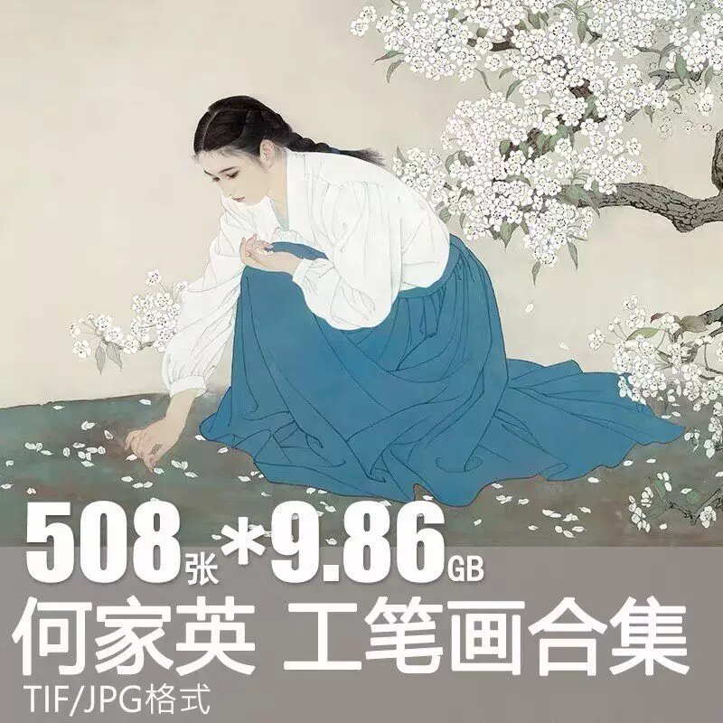
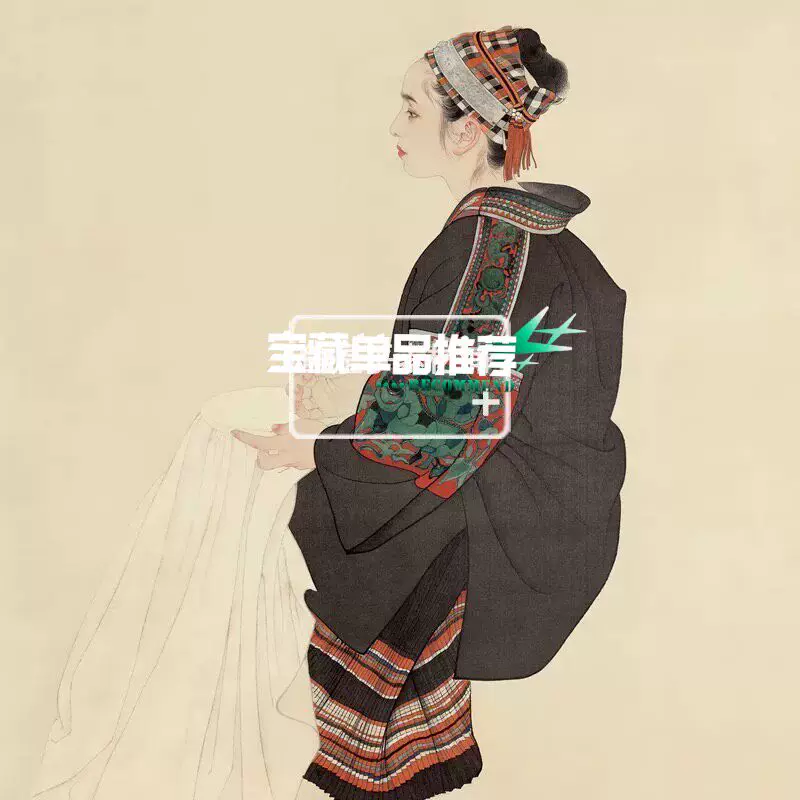
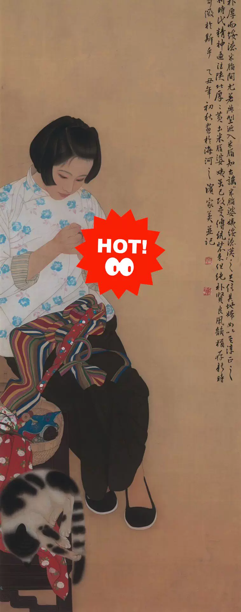
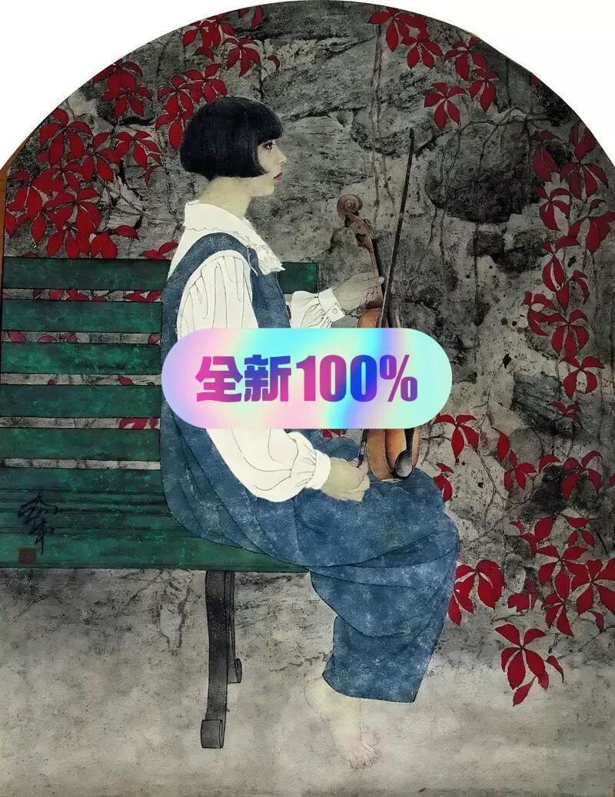
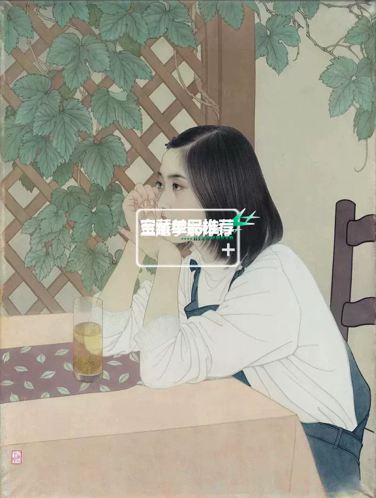
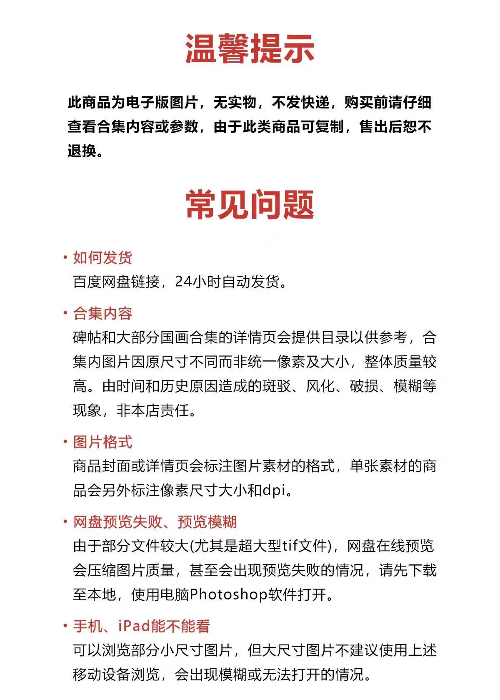
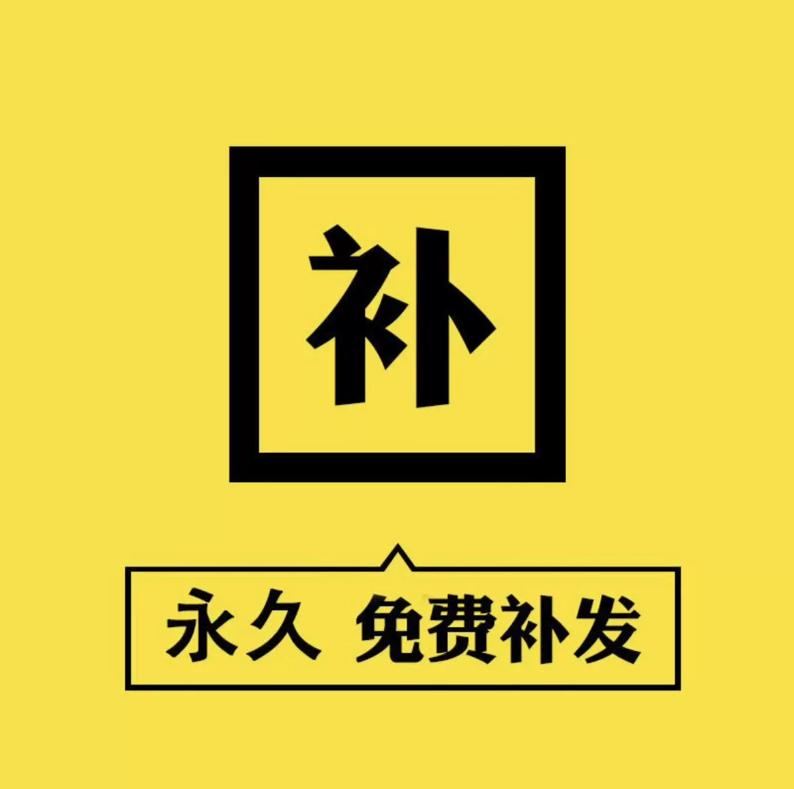
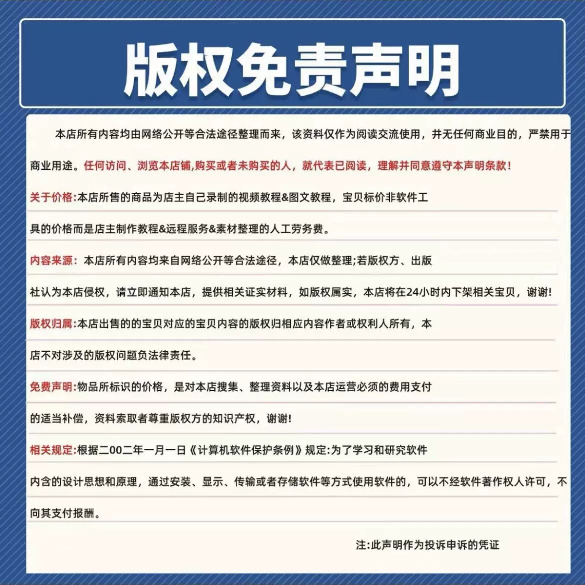
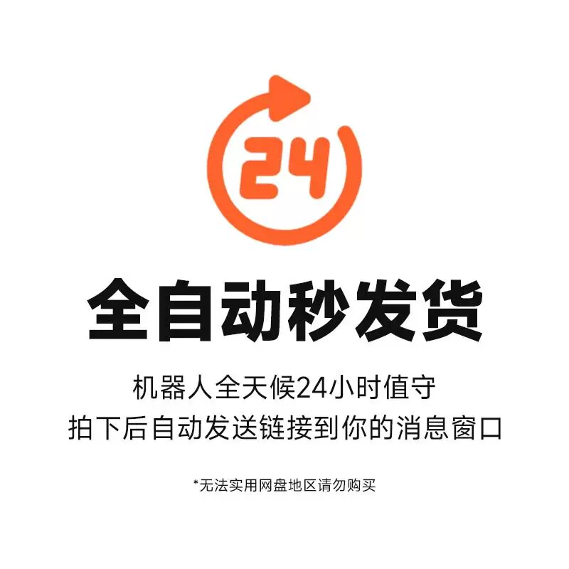

# He Jia Ying's Chinese ink painting design materials

## Body

He Jiaying is a Chinese painter and calligrapher. He was born in 1956 in Hunan Province, China. He studied at the Central Academy of Fine Arts in Beijing and graduated with a master's degree in fine arts. He has won numerous awards for his work, including the National Art Award and the International Calligraphy Prize.

(Full product description was not available from the source page.)

## Images

## Payment

Here is a pay link on Stripe ( https://buy.stripe.com/3cs8yP7sY87d0vu9AB ). Please contact me lonlonago@foxmail.com after funding $89, and I will send you a complete data files , thank you!

